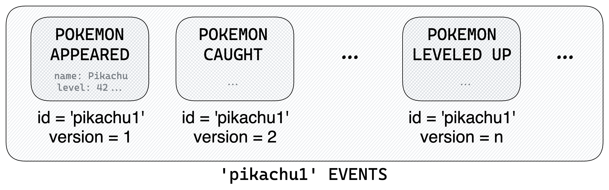
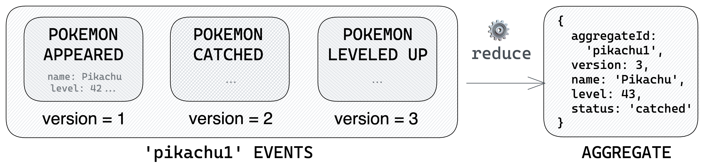
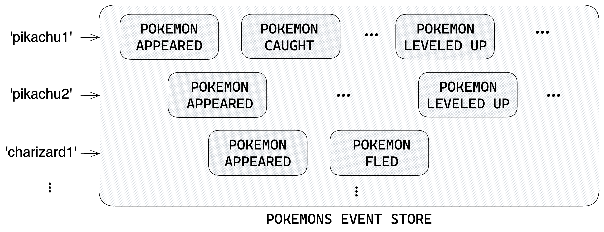
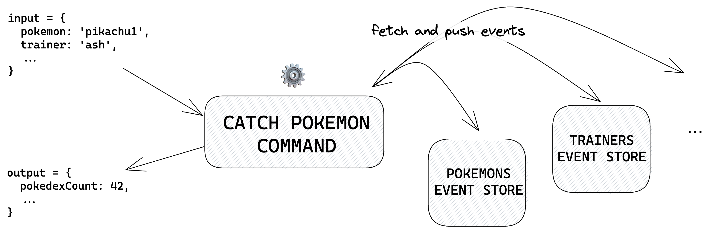
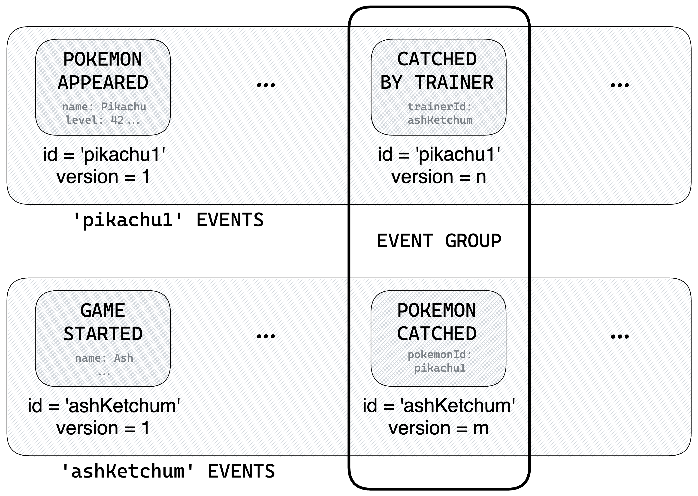
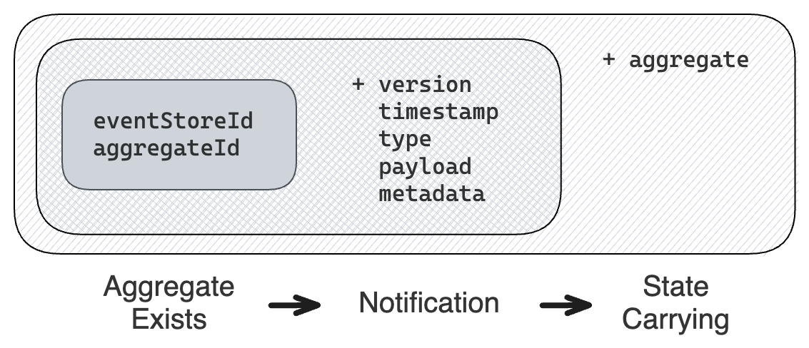
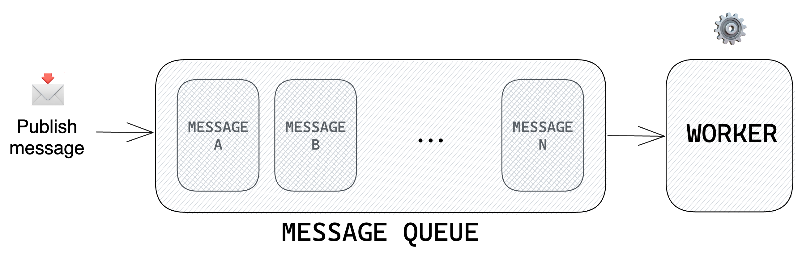

<p align="center">
    
    <h1 style="border-bottom:none;font-size:60px;margin-bottom:0;" align="center" >Castore</h1>
</p>
<p align="center">
  <a aria-label="NPM version" href="https://www.npmjs.com/package/@castore/core">
    
  </a>
  <a aria-label="License" href="https://github.com/castore-dev/castore/blob/main/LICENSE">
    
  </a>
    
    <br/>
    <br/>
</p>

# Making Event Sourcing easy 😎

[Event Sourcing](https://learn.microsoft.com/en-us/azure/architecture/patterns/event-sourcing) is a data storage paradigm that saves **changes in your application state** rather than the state itself.

It is powerful as it enables **rewinding to a previous state** and **exploring audit trails** for debugging or business/legal purposes. It also integrates very well with [event-driven architectures](https://en.wikipedia.org/wiki/Event-driven_architecture).

However, it is **tricky to implement** 😅

After years of using it at [Theodo](https://dev.to/slsbytheodo), we have grown to love it, but also experienced first-hand the lack of consensus and tooling around it. That's where Castore comes from!

---

<p align="center">
  Castore is a TypeScript library that <b>makes Event Sourcing easy</b> 😎
</p>

---

With Castore, you'll be able to:

- Define your [event stores](#--eventstore)
- Fetch and push new [events](#--events) seamlessly
- Implement and test your [commands](#--command)
- ...and much more!

All that with first-class developer experience and minimal boilerplate ✨

## 🫀 Core Design

Some important decisions that we've made early on:

### 💭 **Abstractions first**

Castore has been designed with **flexibility** in mind. It gives you abstractions that are meant to be used **anywhere**: React apps, containers, Lambdas... you name it!

For instance, `EventStore` classes are **stack agnostic**: They need an `EventStorageAdapter` class to interact with actual data. You can code your own `EventStorageAdapter` (simply implement the interface), but it's much simpler to use an off-the-shelf adapter like [`DynamoDBEventStorageAdapter`](./packages/dynamodb-event-storage-adapter/README.md).

### 🙅‍♂️ **We do NOT deploy resources**

While some packages like `DynamoDBEventStorageAdapter` require compatible infrastructure, Castore is not responsible for deploying it.

Though that is not something we exclude in the future, we are a small team and decided to focus on DevX first.

### ⛑ **Full type safety**

Speaking of DevX, we absolutely love TypeScript! If you do too, you're in the right place: We push type-safety to the limit in everything we do!

If you don't, that's fine 👍 Castore is still available in Node/JS. And you can still profit from some nice JSDocs!

### 📖 **Best practices**

The Event Sourcing journey has many hidden pitfalls. We ran into them for you!

Castore is opiniated. It comes with a collection of best practices and documented anti-patterns that we hope will help you out!

## Table of content

- [🎬 Getting Started](#-getting-started)
  - [Installation](#--installation)
  - [Packages structure](#--packages-structure)
- [🚀 The Basics](#-the-basics)
  - [Events](#--events)
  - [Event Types](#--eventtype)
  - [Aggregates](#--aggregate)
  - [Reducers](#--reducer)
  - [Event Store](#--eventstore)
  - [Event Storage Adapter](#---eventstorageadapter)
  - [Command](#--command)
  - [Event Groups](#event-groups)
- [💪 Advanced Usage](#-advanced-usage)
  - [Event-driven architecture](#--event-driven-architecture)
  - [Message queues](#--messagequeue)
  - [Message queue adapters](#--messagequeueadapter)
  - [Message buses](#--messagebus)
  - [Message bus adapters](#--messagebusadapter)
  - [Connected Event Store](#--connectedeventstore)
  - [Snapshotting](#--snapshotting)
  - [Read Models](#--read-models)
- [📖 Resources](#-resources)
  - [Test Tools](#--test-tools)
  - [React Visualizer](#--react-visualizer)
  - [Dam](#--dam)
  - [Packages List](#--packages-list)
  - [Common Patterns](#--common-patterns)

## 🎬 Getting Started

### - Installation

```bash
# npm
npm install @castore/core

# yarn
yarn add @castore/core
```

### - Packages structure

Castore is not a single package, but a **collection of packages** revolving around a `core` package. This is made so every line of code added to your project is _opt-in_, wether you use tree-shaking or not.

Castore packages are **released together**. Though different versions may be compatible, you are **guaranteed** to have working code as long as you use matching versions.

Here is an example of working `package.json`:

```js
{
  ...
  "dependencies": {
    "@castore/core": "1.3.1",
    "@castore/dynamodb-event-storage-adapter": "1.3.1"
    ...
  },
  "devDependencies": {
    "@castore/test-tools": "1.3.1"
    ...
  }
}
```

## 🚀 The Basics

### - `Events`

Event Sourcing is all about **saving changes in your application state**. Such changes are represented by **events**, and needless to say, they are quite important 🙃

Events that concern the same entity (like a `Pokemon`) are aggregated through a common id called `aggregateId` (and vice versa, events that have the same `aggregateId` represent changes of the same business entity). The index of an event in such a serie of events is called its `version`.



In Castore, stored events (also called **event details**) always have exactly the following properties:

- <code>aggregateId <i>(string)</i></code>
- <code>version <i>(integer ≥ 1)</i></code>
- <code>timestamp <i>(string)</i></code>: A date in ISO 8601 format
- <code>type <i>(string)</i></code>: A string identifying the business meaning of the event
- <code>payload <i>(?any = never)</i></code>: A payload of any type
- <code>metadata <i>(?any = never)</i></code>: Some metadata of any type

```ts
import type { EventDetail } from '@castore/core';

type PokemonAppearedEventDetail = EventDetail<
  'POKEMON_APPEARED',
  { name: string; level: number },
  { trigger?: 'random' | 'scripted' }
>;

// 👇 Equivalent to:
type PokemonAppearedEventDetail = {
  aggregateId: string;
  version: number;
  timestamp: string;
  type: 'POKEMON_APPEARED';
  payload: { name: string; level: number };
  metadata: { trigger?: 'random' | 'scripted' };
};
```

### - `EventType`

Events are generally classified in **events types** (not to confuse with TS types). Castore lets you declare them via the `EventType` class:

```ts
import { EventType } from '@castore/core';

const pokemonAppearedEventType = new EventType<
  'POKEMON_APPEARED',
  { name: string; level: number },
  { trigger?: 'random' | 'scripted' }
>({ type: 'POKEMON_APPEARED' });
```

Note that we only provided TS types for `payload` and `metadata` properties. That is because, as stated in the [core design](#-core-design), **Castore is meant to be as flexible as possible**, and that includes the validation library you want to use (if any): The `EventType` class can be used directly if no validation is required, or implemented by other classes which will add run-time validation methods to it 👍

See the following packages for examples:

- [JSON Schema Event Type](./packages/json-schema-event/README.md)
- [Zod Event Type](./packages/zod-event/README.md)

> <details>
> <summary><b>🔧 Technical description</b></summary>
> <p></p>
>
> **Constructor:**
>
> - <code>type <i>(string)</i></code>: The event type
>
> ```ts
> import { EventType } from '@castore/core';
>
> const pokemonAppearedEventType = new EventType({ type: 'POKEMON_APPEARED' });
> ```
>
> **Properties:**
>
> - <code>type <i>(string)</i></code>: The event type
>
> ```ts
> const eventType = pokemonAppearedEventType.type;
> // => 'POKEMON_APPEARED'
> ```
>
> **Type Helpers:**
>
> - <code>EventTypeDetail</code>: Returns the event detail TS type of an `EventType`
>
> ```ts
> import type { EventTypeDetail } from '@castore/core';
>
> type PokemonAppearedEventTypeDetail = EventTypeDetail<
>   typeof pokemonAppearedEventType
> >;
>
> // 👇 Equivalent to:
> type PokemonCaughtEventTypeDetail = {
>   aggregateId: string;
>   version: number;
>   timestamp: string;
>   type: 'POKEMON_APPEARED';
>   payload: { name: string; level: number };
>   metadata: { trigger?: 'random' | 'scripted' };
> };
> ```
>
> - <code>EventTypesDetails</code>: Return the events details of a list of `EventType`
>
> ```ts
> import type { EventTypesDetails } from '@castore/core';
>
> type PokemonEventTypeDetails = EventTypesDetails<
>   [typeof pokemonAppearedEventType, typeof pokemonCaughtEventType]
> >;
> // => EventTypeDetail<typeof pokemonAppearedEventType>
> // | EventTypeDetail<typeof pokemonCaughtEventType>
> ```
>
> </details>

### - `Aggregate`

Eventhough entities are stored as series of events, we still want to use a **simpler and stable interface to represent their states at a point in time** rather than directly using events. In Castore, it is implemented by a TS type called `Aggregate`.

> ☝️ Think of aggregates as _"what the data would look like in CRUD"_

In Castore, aggregates necessarily contain an `aggregateId` and `version` properties (the `version` of the latest `event`). But for the rest, it's up to you 🤷‍♂️

For instance, we can include a `name`, `level` and `status` properties to our `PokemonAggregate`:

```ts
import type { Aggregate } from '@castore/core';

// Represents a Pokemon at a point in time
interface PokemonAggregate extends Aggregate {
  name: string;
  level: number;
  status: 'wild' | 'caught';
}

// 👇 Equivalent to:
interface PokemonAggregate {
  aggregateId: string;
  version: number;
  name: string;
  level: number;
  status: 'wild' | 'caught';
}
```

### - `Reducer`

Aggregates are derived from their events by [reducing them](https://developer.mozilla.org/en-US/docs/Web/JavaScript/Reference/Global_Objects/Array/Reduce) through a `reducer` function. It defines **how to update the aggregate when a new event is pushed**:



```ts
import type { Reducer } from '@castore/core';

const pokemonsReducer: Reducer<PokemonAggregate, PokemonEventDetails> = (
  pokemonAggregate,
  newEvent,
) => {
  const { version, aggregateId } = newEvent;

  switch (newEvent.type) {
    case 'POKEMON_APPEARED': {
      const { name, level } = newEvent.payload;

      // 👇 Return the next version of the aggregate
      return {
        aggregateId,
        version,
        name,
        level,
        status: 'wild',
      };
    }
    case 'POKEMON_CAUGHT':
      return { ...pokemonAggregate, version, status: 'caught' };
    case 'POKEMON_LEVELED_UP':
      return {
        ...pokemonAggregate,
        version,
        level: pokemonAggregate.level + 1,
      };
  }
};

const myPikachuAggregate: PokemonAggregate =
  myPikachuEvents.reduce(pokemonsReducer);
```

> ☝️ Aggregates are always **computed on the fly**, and NOT stored. Changing them does not require any data migration whatsoever.

### - `EventStore`

Once you've defined your [event types](#--eventtype) and how to [aggregate](#--reducer) them, you can bundle them together in an `EventStore` class.

Each event store in your application represents a business entity. Think of event stores as _"what tables would be in CRUD"_, except that instead of directly updating data, you just append new events to it!



In Castore, `EventStore` classes are NOT responsible for actually storing data (this will come with [event storage adapters](#--eventstorageadapter)). But rather to provide a boilerplate-free and type-safe interface to perform many actions such as:

- Listing aggregate ids
- Accessing events of an aggregate
- Building an aggregate with the reducer
- Pushing new events etc...

```ts
import { EventStore } from '@castore/core';

const pokemonsEventStore = new EventStore({
  eventStoreId: 'POKEMONS',
  eventStoreEvents: [
    pokemonAppearedEventType,
    pokemonCaughtEventType,
    pokemonLeveledUpEventType,
    ...
  ],
  reduce: pokemonsReducer,
});
// ...and that's it 🥳
```

> ☝️ The `EventStore` class is the heart of Castore, it even gave it its name!

> <details>
> <summary><b>🔧 Technical description</b></summary>
> <p></p>
>
> **Constructor:**
>
> - <code>eventStoreId <i>(string)</i></code>: A string identifying the event store
> - <code>eventStoreEvents <i>(EventType[])</i></code>: The list of event types in the event store
> - <code>reduce <i>(EventType[])</i></code>: A [reducer function](#--reducer) that can be applied to the store event types
> - <code>onEventPushed <i>(?(pushEventResponse: PushEventResponse => Promise\<void\>))</i></code>: To run a callback after events are pushed (input is exactly the return value of the `pushEvent` method)
> - <code>storageAdapter <i>(?EventStorageAdapter)</i></code>: See [`EventStorageAdapter`](#--eventstorageadapter)
>
> ☝️ The return type of the `reducer` is used to infer the `Aggregate` type of the `EventStore`, so it is important to type it explicitely.
>
> **Properties:**
>
> - <code>eventStoreId <i>(string)</i></code>
>
> ```ts
> const pokemonsEventStoreId = pokemonsEventStore.eventStoreId;
> // => 'POKEMONS'
> ```
>
> - <code>eventStoreEvents <i>(EventType[])</i></code>
>
> ```ts
> const pokemonsEventStoreEvents = pokemonsEventStore.eventStoreEvents;
> // => [pokemonAppearedEventType, pokemonCaughtEventType...]
> ```
>
> - <code>reduce <i>((Aggregate, EventType) => Aggregate)</i></code>
>
> ```ts
> const reducer = pokemonsEventStore.reduce;
> // => pokemonsReducer
> ```
>
> - <code>onEventPushed <i>(?(pushEventResponse: PushEventResponse) => Promise\<void\>)</i></code>: Callback to run after events are pushed
>
> ```ts
> const onEventPushed = pokemonsEventStore.onEventPushed;
> // => undefined (we did not provide one in this example)
> ```
>
> - <code>storageAdapter <i>?EventStorageAdapter</i></code>: See [`EventStorageAdapter`](#--eventstorageadapter)
>
> ```ts
> const storageAdapter = pokemonsEventStore.storageAdapter;
> // => undefined (we did not provide one in this example)
> ```
>
> ☝️ The `storageAdapter` is not read-only so you do not have to provide it right away.
>
> **Sync Methods:**
>
> - <code>getStorageAdapter <i>(() => EventStorageAdapter)</i></code>: Returns the event store event storage adapter if it exists. Throws an `UndefinedStorageAdapterError` if it doesn't.
>
> ```ts
> import { UndefinedStorageAdapterError } from '@castore/core';
>
> expect(() => pokemonsEventStore.getStorageAdapter()).toThrow(
>   new UndefinedStorageAdapterError({ eventStoreId: 'POKEMONS' }),
> );
> // => true
> ```
>
> - <code>buildAggregate <i>((eventDetails: EventDetail[], initialAggregate?: Aggregate) => Aggregate | undefined)</i></code>: Applies the event store reducer to a serie of events.
>
> ```ts
> const myPikachuAggregate = pokemonsEventStore.buildAggregate(myPikachuEvents);
> ```
>
> - <code>groupEvent <i>((eventDetail: EventDetail, opt?: OptionsObj = {}) => GroupedEvent)</i></code>: See [Event Groups](#event-groups).
>
> **Async Methods:**
>
> The following methods interact with the data layer of your event store through its [`EventStorageAdapter`](#--eventstorageadapter). They will throw an `UndefinedStorageAdapterError` if you did not provide one.
>
> - <code>getEvents <i>((aggregateId: string, opt?: OptionsObj = {}) => Promise\<ResponseObj\>)</i></code>: Retrieves the events of an aggregate, ordered by `version`. Returns an empty array if no event is found for this `aggregateId`.
>
>   `OptionsObj` contains the following properties:
>
>   - <code>minVersion <i>(?number)</i></code>: To retrieve events above a certain version
>   - <code>maxVersion <i>(?number)</i></code>: To retrieve events below a certain version
>   - <code>limit <i>(?number)</i></code>: Maximum number of events to retrieve
>   - <code>reverse <i>(?boolean = false)</i></code>: To retrieve events in reverse order (does not require to swap `minVersion` and `maxVersion`)
>
>   `ResponseObj` contains the following properties:
>
>   - <code>events <i>(EventDetail[])</i></code>: The aggregate events (possibly empty)
>
> ```ts
> const { events: allEvents } = await pokemonsEventStore.getEvents(myPikachuId);
> // => typed as PokemonEventDetail[] 🙌
>
> // 👇 Retrieve a range of events
> const { events: rangedEvents } = await pokemonsEventStore.getEvents(
>   myPikachuId,
>   {
>     minVersion: 2,
>     maxVersion: 5,
>   },
> );
>
> // 👇 Retrieve the last event of the aggregate
> const { events: onlyLastEvent } = await pokemonsEventStore.getEvents(
>   myPikachuId,
>   {
>     reverse: true,
>     limit: 1,
>   },
> );
> ```
>
> - <code>getAggregate <i>((aggregateId: string, opt?: OptionsObj = {}) => Promise\<ResponseObj\>)</i></code>: Retrieves the events of an aggregate and build it.
>
>   `OptionsObj` contains the following properties:
>
>   - <code>maxVersion <i>(?number)</i></code>: To retrieve aggregate below a certain version
>
>   `ResponseObj` contains the following properties:
>
>   - <code>aggregate <i>(?Aggregate)</i></code>: The aggregate (possibly `undefined`)
>   - <code>events <i>(EventDetail[])</i></code>: The aggregate events (possibly empty)
>   - <code>lastEvent <i>(?EventDetail)</i></code>: The last event (possibly `undefined`)
>
> ```ts
> const { aggregate: myPikachu } = await pokemonsEventStore.getAggregate(
>   myPikachuId,
> );
> // => typed as PokemonAggregate | undefined 🙌
>
> // 👇 Retrieve an aggregate below a certain version
> const { aggregate: pikachuBelowVersion5 } =
>   await pokemonsEventStore.getAggregate(myPikachuId, { maxVersion: 5 });
>
> // 👇 Returns the events if you need them
> const { aggregate, events } = await pokemonsEventStore.getAggregate(
>   myPikachuId,
> );
> ```
>
> - <code>getExistingAggregate <i>((aggregateId: string, opt?: OptionsObj = {}) => Promise\<ResponseObj\>)</i></code>: Same as `getAggregate` method, but ensures that the aggregate exists. Throws an `AggregateNotFoundError` if no event is found for this `aggregateId`.
>
> ```ts
> import { AggregateNotFoundError } from '@castore/core';
>
> expect(async () =>
>   pokemonsEventStore.getExistingAggregate(unexistingId),
> ).resolves.toThrow(
>   new AggregateNotFoundError({
>     eventStoreId: 'POKEMONS',
>     aggregateId: unexistingId,
>   }),
> );
> // true
>
> const { aggregate } = await pokemonsEventStore.getAggregate(aggregateId);
> // => 'aggregate' and 'lastEvent' are always defined 🙌
> ```
>
> - <code>pushEvent <i>((eventDetail: EventDetail, opt?: OptionsObj = {}) => Promise\<ResponseObj\>)</i></code>: Pushes a new event to the event store. The `timestamp` is optional (we keep it available as it can be useful in tests & migrations). If not provided, it is automatically set as `new Date().toISOString()`. Throws an `EventAlreadyExistsError` if an event already exists for the corresponding `aggregateId` and `version` (see section below on race conditions).
>
>   `OptionsObj` contains the following properties:
>
>   - <code>prevAggregate <i>(?Aggregate)</i></code>: The aggregate at the current version, i.e. before having pushed the event. Can be useful in some cases like when using the [`ConnectedEventStore` class](#--connectedeventstore)
>   - <code>force <i>(?boolean)</i></code>: To force push the event even if one already exists for the corresponding `aggregateId` and `version`. Any existing event will be overridden, so use with extra care, mainly in [data migrations](#--dam).
>
>   `ResponseObj` contains the following properties:
>
>   - <code>event <i>(EventDetail)</i></code>: The complete event (includes the `timestamp`)
>   - <code>nextAggregate <i>(?Aggregate)</i></code>: The aggregate at the new version, i.e. after having pushed the event. Returned only if the event is an initial event, if the `prevAggregate` option was provided, or when using a [`ConnectedEventStore` class](#--connectedeventstore) connected to a [state-carrying message bus or queue](#--event-driven-architecture)
>
> ```ts
> const { event: completeEvent, nextAggregate } =
>   await pokemonsEventStore.pushEvent(
>     {
>       aggregateId: myPikachuId,
>       version: lastVersion + 1,
>       type: 'POKEMON_LEVELED_UP', // <= event type is correctly typed 🙌
>       payload, // <= payload is typed according to the provided event type 🙌
>       metadata, // <= same goes for metadata 🙌
>       // timestamp is optional
>     },
>     // Not required - Can be useful in some cases
>     { prevAggregate },
>   );
> ```
>
> - <code>listAggregateIds <i>((opt?: OptionsObj = {}) => Promise\<ResponseObj\>)</i></code>: Retrieves the list of `aggregateId` of an event store, ordered by the `timestamp` of their initial event. Returns an empty array if no aggregate is found.
>
>   `OptionsObj` contains the following properties:
>
>   - <code>limit <i>(?number)</i></code>: Maximum number of aggregate ids to retrieve
>   - <code>initialEventAfter <i>(?string)</i></code>: To retrieve aggregate ids that appeared after a certain timestamp
>   - <code>initialEventBefore <i>(?string)</i></code>: To retrieve aggregate ids that appeared before a certain timestamp
>   - <code>reverse <i>(?boolean)</i></code>: To retrieve the aggregate ids in reverse order
>   - <code>pageToken <i>(?string)</i></code>: To retrieve a paginated result of aggregate ids
>
>   `ResponseObj` contains the following properties:
>
>   - <code>aggregateIds <i>(string[])</i></code>: The list of aggregate ids
>   - <code>nextPageToken <i>(?string)</i></code>: A token for the next page of aggregate ids if one exists. The nextPageToken carries the previously used options, so you do not have to provide them again (though you can still do it to override them).
>
> ```ts
> const accAggregateIds: string = [];
> const { aggregateIds: firstPage, nextPageToken } =
>   await pokemonsEventStore.listAggregateIds({ limit: 20 });
>
> accAggregateIds.push(...firstPage);
>
> if (nextPageToken) {
>   const { aggregateIds: secondPage } =
>     await pokemonsEventStore.listAggregateIds({
>       // 👇 Previous limit of 20 is passed through the page token
>       pageToken: nextPageToken,
>     });
>   accAggregateIds.push(...secondPage);
> }
> ```
>
> **Type Helpers:**
>
> - <code>EventStoreId</code>: Returns the `EventStore` id
>
> ```ts
> import type { EventStoreId } from '@castore/core';
>
> type PokemonsEventStoreId = EventStoreId<typeof pokemonsEventStore>;
> // => 'POKEMONS'
> ```
>
> - <code>EventStoreEventsTypes</code>: Returns the `EventStore` list of events types
>
> ```ts
> import type { EventStoreEventsTypes } from '@castore/core';
>
> type PokemonEventTypes = EventStoreEventsTypes<typeof pokemonsEventStore>;
> // => [typeof pokemonAppearedEventType, typeof pokemonCaughtEventType...]
> ```
>
> - <code>EventStoreEventsDetails</code>: Returns the union of all the `EventStore` possible events details
>
> ```ts
> import type { EventStoreEventsDetails } from '@castore/core';
>
> type PokemonEventDetails = EventStoreEventsDetails<typeof pokemonsEventStore>;
> // => EventTypeDetail<typeof pokemonAppearedEventType>
> // | EventTypeDetail<typeof pokemonCaughtEventType>
> // | ...
> ```
>
> - <code>EventStoreReducer</code>: Returns the `EventStore` reducer
>
> ```ts
> import type { EventStoreReducer } from '@castore/core';
>
> type PokemonsReducer = EventStoreReducer<typeof pokemonsEventStore>;
> // => Reducer<PokemonAggregate, PokemonEventDetails>
> ```
>
> - <code>EventStoreAggregate</code>: Returns the `EventStore` aggregate
>
> ```ts
> import type { EventStoreAggregate } from '@castore/core';
>
> type SomeAggregate = EventStoreAggregate<typeof pokemonsEventStore>;
> // => PokemonAggregate
> ```
>
> </details>

### - `EventStorageAdapter`

For the moment, we didn't provide any actual way to store our events data. This is the responsibility of the `EventStorageAdapter` class.

```ts
import { EventStore } from '@castore/core';

const pokemonsEventStore = new EventStore({
  eventStoreId: 'POKEMONS',
  eventTypes: pokemonEventTypes,
  reduce: pokemonsReducer,
  // 👇 Provide it in the constructor
  storageAdapter: mySuperStorageAdapter,
});

// 👇 ...or set/switch it in context later
pokemonsEventStore.storageAdapter = mySuperStorageAdapter;
```

You can choose to [build an event storage adapter](./docs/building-your-own-event-storage-adapter.md) that suits your usage. However, we highly recommend using an off-the-shelf adapter:

- [DynamoDB Event Storage Adapter](./packages/dynamodb-event-storage-adapter/README.md)
- [Redux Event Storage Adapter](./packages/redux-event-storage-adapter/README.md)
- [In-Memory Event Storage Adapter](./packages/inmemory-event-storage-adapter/README.md)

If the storage solution that you use is missing, feel free to create/upvote an issue, or contribute 🤗

### - `Command`

Modifying the state of your application (i.e. pushing new events to your event stores) is done by executing **commands**. They typically consist in:

- Fetching the required aggregates (if not the initial event of a new aggregate)
- Validating that the modification is acceptable
- Pushing new events with incremented versions



```ts
import { Command, tuple } from '@castore/core';

type Input = { name: string; level: number };
type Output = { pokemonId: string };
type Context = { generateUuid: () => string };

const catchPokemonCommand = new Command({
  commandId: 'CATCH_POKEMON',
  // 👇 "tuple" is needed to keep ordering in inferred type
  requiredEventStores: tuple(pokemonsEventStore, trainersEventStore),
  // 👇 Code to execute
  handler: async (
    commandInput: Input,
    [pokemonsEventStore, trainersEventStore],
    // 👇 Additional context arguments can be provided
    { generateUuid }: Context,
  ): Promise<Output> => {
    const { name, level } = commandInput;
    const pokemonId = generateUuid();

    await pokemonsEventStore.pushEvent({
      aggregateId: pokemonId,
      version: 1,
      type: 'POKEMON_CAUGHT',
      payload: { name, level },
    });

    return { pokemonId };
  },
});
```

Note that we only provided TS types for `Input` and `Output` properties. That is because, as stated in the [core design](#-core-design), **Castore is meant to be as flexible as possible**, and that includes the validation library you want to use (if any): The `Command` class can be used directly if no validation is required, or implemented by other classes which will add run-time validation methods to it 👍

See the following packages for examples:

- [JSON Schema Event Type](./packages/json-schema-command/README.md)

> <details>
> <summary><b>🔧 Technical description</b></summary>
> <p></p>
>
> **Constructor:**
>
> - <code>commandId <i>(string)</i></code>: A string identifying the command
> - <code>handler <i>((input: Input, requiredEventsStores: EventStore[]) => Promise\<Output\>)</i></code>: The code to execute
> - <code>requiredEventStores <i>(EventStore[])</i></code>: A tuple of `EventStores` that are required by the command for read/write purposes. In TS, you should use the `tuple` util to preserve tuple ordering in the handler (`tuple` doesn't mute its input, it simply returns them)
> - <code>eventAlreadyExistsRetries <i>(?number = 2)</i></code>: Number of handler execution retries before breaking out of the retry loop (See section below on race conditions)
> - <code>onEventAlreadyExists <i>(?(error: EventAlreadyExistsError, context: ContextObj) => Promise\<void\>)</i></code>: Optional callback to execute when an `EventAlreadyExistsError` is raised.
>
>   The `EventAlreadyExistsError` class contains the following properties:
>
>   - <code>eventStoreId <i>(?string)</i></code>: The `eventStoreId` of the aggregate on which the `pushEvent` attempt failed
>   - <code>aggregateId <i>(string)</i></code>: The `aggregateId` of the aggregate
>   - <code>version <i>(number)</i></code>: The `version` of the aggregate
>
>   The `ContextObj` contains the following properties:
>
>   - <code>attemptNumber <i>(?number)</i></code>: The number of handler execution attempts in the retry loop
>   - <code>retriesLeft <i>(?number)</i></code>: The number of retries left before breaking out of the retry loop
>
> ```ts
> import { Command, tuple } from '@castore/core';
>
> const doSomethingCommand = new Command({
>   commandId: 'DO_SOMETHING',
>   requiredEventStores: tuple(eventStore1, eventStore2),
>   handler: async (commandInput, [eventStore1, eventStore2]) => {
>     // ...do something here
>   },
> });
> ```
>
> **Properties:**
>
> - <code>commandId <i>(string)</i></code>: The command id
>
> ```ts
> const commandId = doSomethingCommand.commandId;
> // => 'DO_SOMETHING'
> ```
>
> - <code>requiredEventStores <i>(EventStore[])</i></code>: The required event stores
>
> ```ts
> const requiredEventStores = doSomethingCommand.requiredEventStores;
> // => [eventStore1, eventStore2]
> ```
>
> - <code>handler <i>((input: Input, requiredEventsStores: EventStore[]) => Promise\<Output\>)</i></code>: Function to invoke the command
>
> ```ts
> const output = await doSomethingCommand.handler(input, [
>   eventStore1,
>   eventStore2,
> ]);
> ```
>
> </details>

A few notes on commands handlers:

- `Commands` handlers should NOT use [read models](#--read-models) when validating that a modification is acceptable. Read models are like cache: They are not the source of truth, and may not represent the freshest state.

- Fetching and pushing events non-simultaneously exposes your application to [race conditions](https://en.wikipedia.org/wiki/Race_condition). To counter that, commands are designed to be retried when an `EventAlreadyExistsError` is triggered (which is part of the `EventStorageAdapter` interface).


- Finally, Command handlers should be, as much as possible, [pure functions](https://en.wikipedia.org/wiki/Pure_function). If it depends on impure functions like functions with unpredictable outputs (like id generation), mutating effects, side effects or state dependency (like external data fetching), you should pass them through the additional context arguments rather than directly importing and using them. This will make them easier to test and to re-use in different contexts, such as in the [React Visualizer](./packages/react-visualizer/README.md).

### Event Groups

Some commands can have an effect on several event stores, or on several aggregates of the same event store. For instance, the `CATCH_POKEMON` command could write both a `CAUGHT_BY_TRAINER` event on a pokemon aggregate (changing its `status` to `'caught'`) and a `POKEMON_CAUGHT` event on a trainer aggregate (appending the `pokemonId` to its `pokedex`).



To not have your application in a corrupt state, it's important to make sure that **all those events are pushed or none**. In Castore, this can be done through the **event groups** API:

- You can use the `groupEvent` method to build an array of events that are to be pushed together. It has the same input interface as `pushEvent` but synchronously returns a `GroupedEvent` class.
- The `EventStore` class exposes a static `pushEventGroup` method that can be used to effectively push this event group.

```ts
await EventStore.pushEventGroup(
  pokemonsEventStore.groupEvent({
    // 👇 Correctly typed
    aggregateId: 'pikachu1',
    type: 'CAUGHT_BY_TRAINER',
    payload: { trainerId: 'ashKetchum' },
    ...
  }),
  trainersEventStore.groupEvent({
    aggregateId: 'ashKetchum',
    type: 'POKEMON_CAUGHT',
    payload: { pokemonId: 'pikachu1' },
    ...
  }),
);
```

Like the `pushEvent` API, event groups are designed to throw an `EventAlreadyExistsError` if the transaction has failed, making sure that commands are retried as expected when race conditions arise.

> ☝️ When pushing event groups on several event stores, they must use the same type of event storage adapters.
>
> ☝️ Also, be aware of technical constraints of your event storage solution. For instance, the [`DynamoDBEventStorageAdapter`](./packages/dynamodb-event-storage-adapter/README.md)'s implementation is based on [DynamoDB transactions](https://docs.aws.amazon.com/amazondynamodb/latest/developerguide/transaction-apis.html), which means that the event stores tables must be in the same region, and that a groups cannot contain more than 100 events.

## 💪 Advanced usage

### - Event-driven architecture

Event Sourcing integrates very well with [event-driven architectures](https://en.wikipedia.org/wiki/Event-driven_architecture). In a traditional architecture, you would need to design your system events (or **messages** for clarity) separately from your data. With Event Sourcing, they can simply **broadcast the business events you already designed**.

In Castore, we distinguish three types of message:

- **AggregateExists messages** which only carry aggregate ids (mainly for maintenance purposes)
- **Notification messages** which also carry event details
- **State-carrying messages** which also carry their corresponding aggregates



In Castore, they are implemented by the `AggregateExistsMessage`, `NotificationMessage` and `StateCarryingMessage` TS types:

```ts
// AggregateExistsMessage
import type {
  AggregateExistsMessage,
  EventStoreAggregateExistsMessage,
} from '@castore/core';

type PokemonAggregateExistsMessage = AggregateExistsMessage<'POKEMONS'>;

// 👇 Equivalent to:
type PokemonAggregateExistsMessage = {
  eventStoreId: 'POKEMONS';
  aggregateId: string;
};

// // 👇 Also equivalent to:
type PokemonAggregateExistsMessage = EventStoreAggregateExistsMessage<
  typeof pokemonsEventStore
>;
```

```ts
// NotificationMessage
import type {
  NotificationMessage,
  EventStoreNotificationMessage,
} from '@castore/core';

type PokemonEventNotificationMessage = NotificationMessage<
  'POKEMONS',
  PokemonEventDetails
>;

// 👇 Equivalent to:
type PokemonEventNotificationMessage = {
  eventStoreId: 'POKEMONS';
  event: PokemonEventDetails;
};

// 👇 Also equivalent to:
type PokemonEventNotificationMessage = EventStoreNotificationMessage<
  typeof pokemonsEventStore
>;
```

```ts
// StateCarryingMessage
import type {
  StateCarryingMessage,
  EventStoreStateCarryingMessage,
} from '@castore/core';

type PokemonEventStateCarryingMessage = StateCarryingMessage<
  'POKEMONS',
  PokemonEventDetails,
  PokemonAggregate
>;

// 👇 Equivalent to:
type PokemonEventStateCarryingMessage = {
  eventStoreId: 'POKEMONS';
  event: PokemonEventDetails;
  aggregate: PokemonAggregate
};

// 👇 Also equivalent to:
type PokemonEventStateCarryingMessage = EventStoreStateCarryingMessage<
  typeof pokemonsEventStore
>;
```

All types of message can be published through message channels, i.e. [Message Queues](#--messagequeue) or [Message Buses](#--messagebus).

### - `MessageQueue`

[Message Queues](https://en.wikipedia.org/wiki/Message_queue) store the published messages until they are handled by a **worker**. The worker is unique and predictible. It consumes all messages indifferently of their content.



You can use the `AggregateExistsMessageQueue`, `NotificationMessageQueue` or `StateCarryingMessageQueue` classes to implement message queues:

```ts
import { NotificationMessageQueue } from '@castore/core';

const appMessageQueue = new NotificationMessageQueue({
  messageQueueId: 'APP_MESSAGE_QUEUE',
  sourceEventStores: [pokemonsEventStore, trainersEventStore],
});

await appMessageQueue.publishMessage({
  // 👇 Typed as NotificationMessage of one of the source event stores
  eventStoreId: 'POKEMONS',
  event: {
    type: 'POKEMON_LEVELED_UP',
    ...
  },
});

// Similar for AggregateExistsMessageQueue and StateCarryingMessageQueue
```

> <details>
> <summary><b>🔧 Technical description</b></summary>
> <p></p>
>
> **Constructor:**
>
> - <code>messageQueueId <i>(string)</i></code>: A string identifying the message queue
> - <code>sourceEventStores <i>(EventStore[])</i></code>: List of event stores that the message queue will broadcast events from
> - <code>messageQueueAdapter <i>(?MessageChannelAdapter)</i></code>: See section on [`MessageQueueAdapters`](#--messagequeueadapter)
>
> **Properties:**
>
> - <code>messageChannelId <i>(string)</i></code>
>
> ```ts
> const appMessageQueueId = appMessageQueue.messageChannelId;
> // => 'APP_MESSAGE_QUEUE'
> ```
>
> - <code>sourceEventStores <i>(EventStore[])</i></code>
>
> ```ts
> const appMessageQueueSourceEventStores = appMessageQueue.sourceEventStores;
> // => [pokemonsEventStore, trainersEventStore...]
> ```
>
> - <code>messageChannelAdapter <i>?MessageChannelAdapter</i></code>: See section on [`MessageQueueAdapters`](#--messagequeueadapter)
>
> ```ts
> const appMessageQueueAdapter = appMessageQueue.messageChannelAdapter;
> // => undefined (we did not provide one in this example)
> ```
>
> ☝️ The `messageChannelAdapter` is not read-only so you do not have to provide it right away.
>
> **Async Methods:**
>
> The following methods interact with the messaging solution of your application through a `MessageQueueAdapter`. They will throw an `UndefinedMessageChannelAdapterError` if you did not provide one.
>
> - <code>publishMessage <i>(message: Message, opt?: OptionsObj = {}) => Promise\<void\>)</i></code>: Publish a `Message` (of the appropriate type) to the message queue.
>
>   `OptionsObj` contains the following properties:
>
>   - <code>replay <i>(?boolean = false)</i></code>: Signals that the event is not happening in real-time, e.g. in maintenance or migration operations. This information can be used downstream to react appropriately. Check the implementation of you adapter for more details.
>
> - <code>publishMessages <i>(messages: Message[], opt?: OptionsObj) => Promise\<void\>)</i></code>: Publish several `Messages` (of the appropriate type) to the message queue. Options are similar to the `publishMessage` options.
>
> - <code>getAggregateAndPublishMessage <i>((message: NotificationMessage) => Promise\<void\>)</i></code>: _(StateCarryingMessageQueues only)_ Append the matching aggregate (with correct version) to a `NotificationMessage` and turn it into a `StateCarryingMessage` before publishing it to the message queue. Uses the message queue event stores: Make sure that they have correct adapters set up.
>
> **Type Helpers:**
>
> - <code>MessageChannelMessage</code>: Given a `MessageQueue`, returns the TS type of its messages
>
> ```ts
> import type { MessageChannelMessage } from '@castore/core';
>
> type AppMessage = MessageChannelMessage<typeof appMessageQueue>;
>
> // 👇 Equivalent to:
> type AppMessage = EventStoreNotificationMessage<
>   typeof pokemonsEventStore | typeof trainersEventStore...
> >;
> ```
>
> </details>

### - `MessageQueueAdapter`

Similarly to event stores, `MessageQueue` classes provide a boilerplate-free and type-safe interface to publish messages, but are NOT responsible for actually doing so. This is the responsibility of the `MessageQueueAdapter`, that will connect it to your actual messaging solution:

```ts
import { EventStore } from '@castore/core';

const messageQueue = new NotificationMessageQueue({
  ...
  // 👇 Provide it in the constructor
  messageQueueAdapter: mySuperMessageQueueAdapter,
});

// 👇 ...or set/switch it in context later
messageQueue.messageChannelAdapter = mySuperMessageQueueAdapter;
// Named `messageChannelAdapter` as queues inherit from the `MessageChannel` class
```

You can code your own `MessageQueueAdapter` (simply implement the `MessageChannelAdapter` interface), but we highly recommend using an off-the-shelf adapter:

- [SQS Message Queue Adapter](./packages/sqs-message-queue-adapter/README.md)
- [In-Memory Message Queue Adapter](./packages/in-memory-message-queue-adapter/README.md)

If the messaging solution that you use is missing, feel free to create/upvote an issue, or contribute 🤗

The adapter packages will also expose useful generics to type the arguments of your queue worker. For instance:

```ts
import type {
  SQSMessageQueueMessage,
  SQSMessageQueueMessageBody,
} from '@castore/sqs-message-queue-adapter';

const appMessagesWorker = async ({ Records }: SQSMessageQueueMessage) => {
  Records.forEach(({ body }) => {
    // 👇 Correctly typed!
    const recordBody: SQSMessageQueueMessageBody<typeof appMessageQueue> =
      JSON.parse(body);
  });
};
```

### - `MessageBus`

[Message Buses](https://en.wikipedia.org/wiki/Publish%E2%80%93subscribe_pattern) are used to spread messages to multiple **listeners**. Contrary to message queues, they do not store the message or wait for the listeners to respond. Often, **filter patterns** can also be used to trigger listeners or not based on the message content.


You can use the `AggregateExistsMessageBus`, `NotificationMessageBus` or `StateCarryingMessageBus` classes to implement message buses:

```ts
import { NotificationMessageBus } from '@castore/core';

const appMessageBus = new NotificationMessageBus({
  messageBusId: 'APP_MESSAGE_BUSES',
  sourceEventStores: [pokemonsEventStore, trainersEventStore...],
});

await appMessageBus.publishMessage({
  // 👇 Typed as NotificationMessage of one of the source event stores
  eventStoreId: 'POKEMONS',
  event: {
    type: 'POKEMON_LEVELED_UP',
    ...
  }
})

// Similar for AggregateExistsMessageBus and StateCarryingMessageBus
```

> <details>
> <summary><b>🔧 Technical description</b></summary>
> <p></p>
>
> **Constructor:**
>
> - <code>messageBusId <i>(string)</i></code>: A string identifying the message bus
> - <code>sourceEventStores <i>(EventStore[])</i></code>: List of event stores that the message bus will broadcast events from
> - <code>messageBusAdapter <i>(?MessageChannelAdapter)</i></code>: See section on [`MessageBusAdapters`](#--messagebusadapter)
>
> **Properties:**
>
> - <code>messageBusId <i>(string)</i></code>
>
> ```ts
> const appMessageBusId = appMessageBus.messageBusId;
> // => 'APP_MESSAGE_BUS'
> ```
>
> - <code>sourceEventStores <i>(EventStore[])</i></code>
>
> ```ts
> const appMessageBusSourceEventStores = appMessageBus.sourceEventStores;
> // => [pokemonsEventStore, trainersEventStore...]
> ```
>
> - <code>messageChannelAdapter <i>?MessageChannelAdapter</i></code>: See section on [`MessageBusAdapters`](#--messagebusadapter)
>
> ```ts
> const appMessageBusAdapter = appMessageBus.messageChannelAdapter;
> // => undefined (we did not provide one in this example)
> ```
>
> ☝️ The `messageChannelAdapter` is not read-only so you do not have to provide it right away.
>
> **Async Methods:**
>
> The following methods interact with the messaging solution of your application through a `MessageBusAdapter`. They will throw an `UndefinedMessageChannelAdapterError` if you did not provide one.
>
> - <code>publishMessage <i>(message: Message, opt?: OptionsObj = {}) => Promise\<void\>)</i></code>: Publish a `Message` (of the appropriate type) to the message bus.
>
>   `OptionsObj` contains the following properties:
>
>   - <code>replay <i>(?boolean = false)</i></code>: Signals that the event is not happening in real-time, e.g. in maintenance or migration operations. This information can be used downstream to react appropriately. Check the implementation of you adapter for more details.
>
> - <code>publishMessages <i>(messages: Message[], opt?: OptionsObj) => Promise\<void\>)</i></code>: Publish several `Messages` (of the appropriate type) to the message bus. Options are similar to the `publishMessage` options.
>
> - <code>getAggregateAndPublishMessage <i>((message: NotificationMessage) => Promise\<void\>)</i></code>: _(StateCarryingMessageBuses only)_ Append the matching aggregate (with correct version) to a `NotificationMessage` and turn it into a `StateCarryingMessage` before publishing it to the message bus. Uses the message bus event stores: Make sure that they have correct adapters set up.
>
> **Type Helpers:**
>
> - <code>MessageChannelMessage</code>: Given a `MessageBus`, returns the TS type of its messages
>
> ```ts
> import type { MessageChannelMessage } from '@castore/core';
>
> type AppMessage = MessageChannelMessage<typeof appMessageBus>;
>
> // 👇 Equivalent to:
> type AppMessage = EventStoreNotificationMessage<
>   typeof pokemonsEventStore | typeof trainersEventStore...
> >;
> ```
>
> </details>

### - `MessageBusAdapter`

Similarly to event stores, `MessageBus` classes provide a boilerplate-free and type-safe interface to publish messages, but are NOT responsible for actually doing so. This is the responsibility of the `MessageBusAdapter`, that will connect it to your actual messaging solution:

```ts
import { EventStore } from '@castore/core';

const messageBus = new NotificationMessageBus({
  ...
  // 👇 Provide it in the constructor
  messageBusAdapter: mySuperMessageBusAdapter,
});

// 👇 ...or set/switch it in context later
messageBus.messageChannelAdapter = mySuperMessageBusAdapter;
// Named `messageChannelAdapter` as buses inherit from the `MessageChannel` class
```

You can code your own `MessageBusAdapter` (simply implement the `MessageChannelAdapter` interface), but we highly recommend using an off-the-shelf adapter:

- [EventBridge Message Bus Adapter](./packages/event-bridge-message-bus-adapter/README.md)
- [In-Memory Message Bus Adapter](./packages/in-memory-message-bus-adapter/README.md)

If the messaging solution that you use is missing, feel free to create/upvote an issue, or contribute 🤗

The adapter packages will also expose useful generics to type the arguments of your bus listeners. For instance:

```ts
import type { EventBridgeMessageBusMessage } from '@castore/event-bridge-message-bus-adapter';

const pokemonMessagesListener = async (
  // 👇 Specify that you only listen to the pokemonsEventStore messages
  eventBridgeMessage: EventBridgeMessageBusMessage<
    typeof appMessageQueue,
    'POKEMONS'
  >,
) => {
  // 👇 Correctly typed!
  const message = eventBridgeMessage.detail;
};
```

### - `ConnectedEventStore`

If your storage solution exposes data streaming capabilities (such as [DynamoDB streams](https://docs.aws.amazon.com/amazondynamodb/latest/developerguide/Streams.html)), you can leverage them to push your freshly written events to a message bus or queue.

You can also use the `ConnectedEventStore` class. Its interface matches the `EventStore` one, but successfully pushing a new event will automatically forward it to a message queue/bus, and pushing a event group will also automatically forward the events to their respective message queues/buses:

```ts
import { ConnectedEventStore } from '@castore/core';

const connectedPokemonsEventStore = new ConnectedEventStore(
  // 👇 Original event store
  pokemonsEventStore,
  // 👇 Type-safe (appMessageBus MUST be able to carry pokemon events)
  appMessageBus,
);

// Will push the event in the event store
// ...AND publish it to the message bus if it succeeds 🙌
await connectedPokemonsEventStore.pushEvent({
  aggregateId: pokemonId,
  version: 2,
  type: 'POKEMON_LEVELED_UP',
  ...
});
```

> Note that setting a connected event store `storageAdapter` and `onEventPushed` properties will override those of the original event store instead.

If the message bus or queue is a state-carrying one, the `pushEvent` method will re-fetch the aggregate to append it to the message before publishing it. You can reduce this overhead by providing the previous aggregate as an option:

```ts
await connectedPokemonsEventStore.pushEvent(
  {
    aggregateId: pokemonId,
    version: 2,
    ...
  },
  // 👇 Aggregate at version 1
  { prevAggregate: pokemonAggregate },
  // Removes the need to re-fetch 🙌
);
```


Compared to data streams, connected event stores have the advantage of simplicity, performances and costs. However, they **strongly decouple your storage and messaging solutions**: Make sure to anticipate any issue that might arise (consistency, non-caught errors etc.).

> <details>
> <summary><b>🔧 Technical description</b></summary>
> <p></p>
>
> **Constructor:**
>
> - <code>eventStore <i>(EventStore)</i></code>: The event store to connect
> - <code>messageChannel <i>(MessageBus | MessageQueue)</i></code>: A message bus or queue to forward events to
>
> **Properties:**
>
> A `ConnectedEventStore` will implement the interface of its original `EventStore`, and extend it with two additional properties:
>
> - <code>eventStore <i>(EventStore)</i></code>: The original event store
>
> ```ts
> const eventStore = connectedPokemonsEventStore.eventStore;
> // => pokemonsEventStore
> ```
>
> - <code>messageChannel <i>(MessageBus | MessageQueue)</i></code>: The provided message bus or queue
>
> ```ts
> const messageChannel = connectedPokemonsEventStore.messageChannel;
> // => appMessageBus
> ```
>
> Note that the `storageAdapter` property will act as a pointer toward the original event store `storageAdapter`:
>
> ```ts
> originalEventStore.storageAdapter = myStorageAdapter;
> connectedEventStore.storageAdapter; // => myStorageAdapter
>
> connectedEventStore.storageAdapter = anotherStorageAdapter;
> originalEventStore.storageAdapter; // => anotherStorageAdapter
> ```
>
> </details>

### - Snapshotting

As events pile up in your event stores, the performances and costs of your commands can become an issue.

One solution is to periodially persist **snapshots** of your aggregates (e.g. through a message bus listener), and only fetch them plus the subsequent events instead of all the events.

Snapshots are not implemented in Castore yet, but we have big plans for them, so stay tuned 🙂

### - Read Models

Even with snapshots, using the event store for querying needs (like displaying data in a web page) would be slow and inefficient, if not impossible depending on the access pattern.

In Event Sourcing, it is common to use a special type of message bus listener called **projections**, responsible for maintaining data specifically designed for querying needs, called **read models**.

Read models allow for faster read operations, as well as re-indexing. Keep in mind that they are [eventually consistent](https://en.wikipedia.org/wiki/Eventual_consistency) by design, which can be annoying in some use cases (like opening a resource page directly after its creation).

Read models are not implemented in Castore yet, but we have big plans for them, so stay tuned 🙂

## 📖 Resources

### - Test Tools

Castore comes with a handy [Test Tool package](./packages/test-tools/README.md) that facilitates the writing of unit tests: It allows mocking event stores, populating them with an initial state and resetting them to it in a boilerplate-free and type-safe way.

### - Dam

[Dam](./packages/dam/README.md) is a suite of utils that facilitates data migration and maintenance operations with Castore (for instance, dispatching all the events of an event store - ordered by their timestamps - to a message queue).

### - React Visualizer

Castore also comes with a handy [React Visualizer](./packages/react-visualizer/README.md) library: It exposes a React component to visualize, design and manually test Castore event stores and commands.

### - Packages List

#### Event Types

- [JSON Schema Event Type](./packages/json-schema-event/README.md): DRY `EventType` definition using [JSON Schemas](http://json-schema.org/understanding-json-schema/reference/index.html) and [`json-schema-to-ts`](https://github.com/ThomasAribart/json-schema-to-ts)
- [Zod Event Type](./packages/zod-event/README.md): DRY `EventType` definition using [`zod`](https://github.com/colinhacks/zod)

#### Event Storage Adapters

- [DynamoDB Event Storage Adapter](./packages/dynamodb-event-storage-adapter/README.md): Implementation of the `EventStorageAdapter` interface based on DynamoDB.
- [Redux Event Storage Adapter](./packages/redux-event-storage-adapter/README.md): Implementation of the `EventStorageAdapter` interface based on a Redux store, along with tooling to configure the store and hooks to read from it efficiently.
- [In-Memory Event Storage Adapter](./packages/inmemory-event-storage-adapter/README.md): Implementation of the `EventStorageAdapter` interface using a local Node/JS object. To be used in manual or unit tests.

#### Commands

- [JSON Schema Command](./packages/json-schema-command/README.md): DRY `Command` definition using [JSON Schemas](http://json-schema.org/understanding-json-schema/reference/index.html) and [`json-schema-to-ts`](https://github.com/ThomasAribart/json-schema-to-ts)

#### Message Queue Adapters

- [SQS Message Queue Adapter](./packages/sqs-message-queue-adapter/README.md): Implementation of the `MessageQueueAdapter` interface based on AWS SQS.
- [In-Memory Message Queue Adapter](./packages/in-memory-message-queue-adapter/README.md): Implementation of the `MessageQueueAdapter` interface using a local Node/JS queue. To be used in manual or unit tests.

#### Message Buses Adapters

- [EventBridge Message Bus Adapter](./packages/event-bridge-message-bus-adapter/README.md): Implementation of the `MessageBusAdapter` interface based on AWS EventBridge.
- [In-Memory Message Bus Adapter](./packages/in-memory-message-bus-adapter/README.md): Implementation of the `MessageBusAdapter` interface using a local Node/JS event emitter. To be used in manual or unit tests.

### - Common Patterns

- Simulating a future/past aggregate state: _...coming soon_
- Snapshotting: _...coming soon_
- Projecting on read models: _...coming soon_
- Replaying events: _...coming soon_
- Migrating events: _...coming soon_
