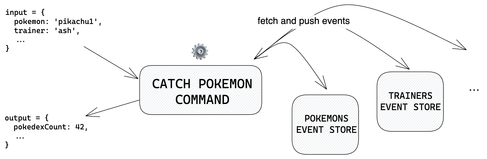

# ✍️ Pushing events

Modifying the state of your application (i.e. pushing new events to your event stores) is done by executing **commands**. They typically consist in:

- **Fetching the required aggregates** (if not the initial event of a new aggregate)
- **Validating** that the modification is acceptable
- **Pushing new events** with incremented versions



```ts
import { Command, tuple } from '@castore/core';

type Input = { name: string; level: number };
type Output = { pokemonId: string };
type Context = { generateUuid: () => string };

const catchPokemonCommand = new Command({
  commandId: 'CATCH_POKEMON',
  // 👇 "tuple" is needed to keep ordering in inferred type
  requiredEventStores: tuple(pokemonsEventStore, trainersEventStore),
  // 👇 Code to execute
  handler: async (
    commandInput: Input,
    [pokemonsEventStore, trainersEventStore],
    // 👇 Additional context arguments can be provided
    { generateUuid }: Context,
  ): Promise<Output> => {
    const { name, level } = commandInput;
    const pokemonId = generateUuid();

    await pokemonsEventStore.pushEvent({
      aggregateId: pokemonId,
      version: 1,
      type: 'POKEMON_CAUGHT',
      payload: { name, level },
    });

    return { pokemonId };
  },
});
```

:::info

Note that we only provided TS types for `Input` and `Output` properties. That is because, as stated in the [core design](/docs/introduction#-core-design), **Castore is meant to be as flexible as possible**, and that includes the validation library you want to use (if any): The `Command` class can be used directly if no validation is required, or implemented by [other classes](../5-resources.md) which will add run-time validation methods to it 👍

:::

`Commands` handlers should NOT use [read models](/docs/advanced-usage#read-models) when validating that a modification is acceptable. Read models are like cache: They are not the source of truth, and may not represent the freshest state.

Fetching and pushing events non-simultaneously exposes your application to [race conditions](https://en.wikipedia.org/wiki/Race_condition). To counter that, commands are designed to be retried when an `EventAlreadyExistsError` is triggered (which is part of the `EventStorageAdapter` interface).


Finally, Command handlers should be, as much as possible, [pure functions](https://en.wikipedia.org/wiki/Pure_function). If they depend on impure functions like functions with unpredictable outputs (e.g. id generation), mutating effects, side effects or state dependency (e.g. external data fetching), you should pass them through the additional context arguments rather than directly importing and using them. This will make them easier to test and to re-use in different contexts, such as in the [React Visualizer](https://www.npmjs.com/package/@castore/react-visualizer).

> <details>
> <summary><b>🔧 Reference</b></summary>
> <p></p>
>
> **Constructor:**
>
> - <code>commandId <i>(string)</i></code>: A string identifying the command
> - <code>handler <i>((input: Input, requiredEventsStores: EventStore[]) => Promise(Output))</i></code>: The code to execute
> - <code>requiredEventStores <i>(EventStore[])</i></code>: A tuple of <code>EventStores</code> that are required by the command for read/write purposes. In TS, you should use the <code>tuple</code> util to preserve tuple ordering in the handler (<code>tuple</code> doesn't mute its inputs, it simply returns them)
> - <code>eventAlreadyExistsRetries <i>(?number = 2)</i></code>: Number of handler execution retries before breaking out of the retry loop (See section below on race conditions)
> - <code>onEventAlreadyExists <i>(?(error: EventAlreadyExistsError, context: ContextObj) => Promise(void))</i></code>: Optional callback to execute when an <code>EventAlreadyExistsError</code> is raised.
>
>   The `EventAlreadyExistsError` class contains the following properties:
>
>   - <code>eventStoreId <i>(?string)</i></code>: The <code>eventStoreId</code> of the aggregate on which the <code>pushEvent</code> attempt failed
>   - <code>aggregateId <i>(string)</i></code>: The <code>aggregateId</code> of the aggregate
>   - <code>version <i>(number)</i></code>: The <code>version</code> of the aggregate
>
>   The `ContextObj` contains the following properties:
>
>   - <code>attemptNumber <i>(?number)</i></code>: The number of handler execution attempts in the retry loop
>   - <code>retriesLeft <i>(?number)</i></code>: The number of retries left before breaking out of the retry loop
>
> ```ts
> import { Command, tuple } from '@castore/core';
>
> const doSomethingCommand = new Command({
>   commandId: 'DO_SOMETHING',
>   requiredEventStores: tuple(eventStore1, eventStore2),
>   handler: async (commandInput, [eventStore1, eventStore2]) => {
>     // ...do something here
>   },
> });
> ```
>
> **Properties:**
>
> - <code>commandId <i>(string)</i></code>: The command id
>
> ```ts
> const commandId = doSomethingCommand.commandId;
> // => 'DO_SOMETHING'
> ```
>
> - <code>requiredEventStores <i>(EventStore[])</i></code>: The required event stores
>
> ```ts
> const requiredEventStores = doSomethingCommand.requiredEventStores;
> // => [eventStore1, eventStore2]
> ```
>
> - <code>handler <i>((input: Input, requiredEventsStores: EventStore[]) => Promise(Output))</i></code>: Function to invoke the command
>
> ```ts
> const output = await doSomethingCommand.handler(input, [
>   eventStore1,
>   eventStore2,
> ]);
> ```
>
> </details>
