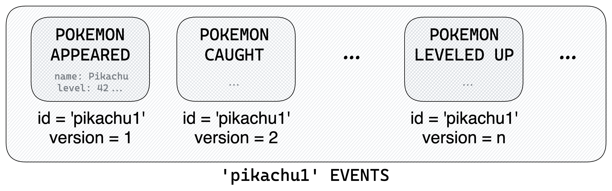
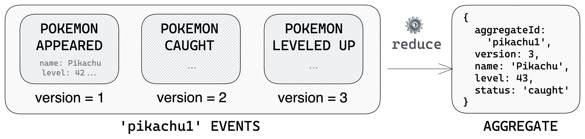
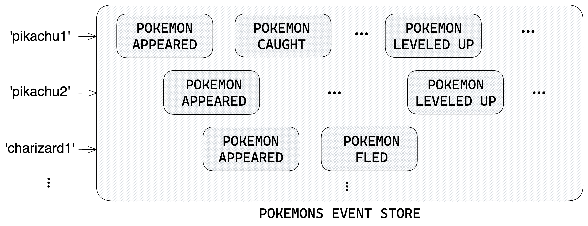
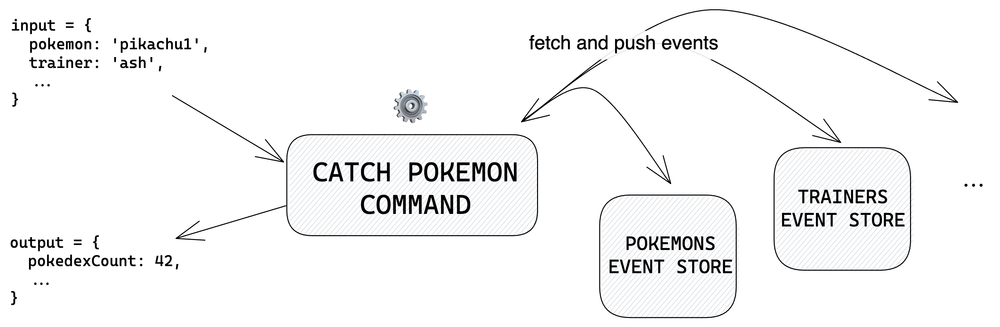
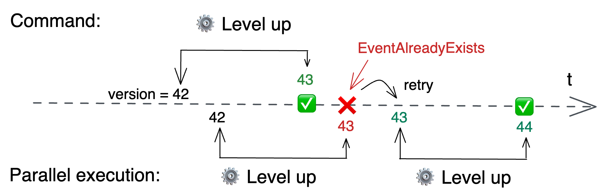
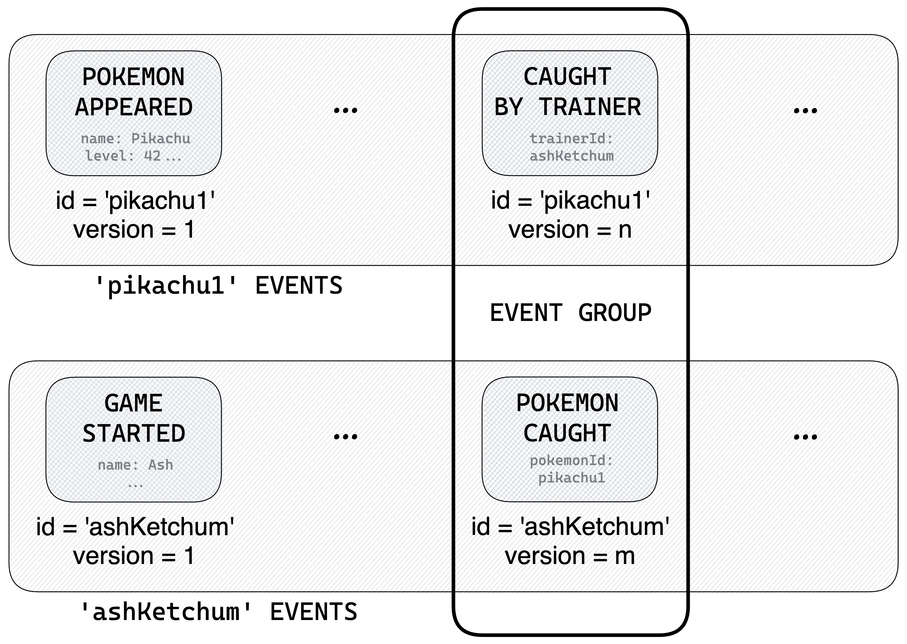

# 🚀 The Basics

## `Events`

Event Sourcing is all about **saving changes in your application state**. Such changes are represented by **events**, and needless to say, they are quite important 🙃

Events that concern the same entity (like a `Pokemon`) are aggregated through a common id called `aggregateId` (and vice versa, events that have the same `aggregateId` represent changes of the same business entity). The index of an event in such a serie of events is called its `version`.



In Castore, stored events (also called **event details**) always have exactly the following properties:

- <code>aggregateId <i>(string)</i></code>
- <code>version <i>(integer ≥ 1)</i></code>
- <code>timestamp <i>(string)</i></code>: A date in ISO 8601 format
- <code>type <i>(string)</i></code>: A string identifying the business meaning of the event
- <code>payload <i>(?any = never)</i></code>: A payload of any type
- <code>metadata <i>(?any = never)</i></code>: Some metadata of any type

```ts
import type { EventDetail } from '@castore/core';

type PokemonAppearedEventDetail = EventDetail<
  'POKEMON_APPEARED',
  { name: string; level: number },
  { trigger?: 'random' | 'scripted' }
>;

// 👇 Equivalent to:
type PokemonAppearedEventDetail = {
  aggregateId: string;
  version: number;
  timestamp: string;
  type: 'POKEMON_APPEARED';
  payload: { name: string; level: number };
  metadata: { trigger?: 'random' | 'scripted' };
};
```

## `EventType`

Events are generally classified in **events types** (not to confuse with TS types). Castore lets you declare them via the `EventType` class:

```ts
import { EventType } from '@castore/core';

const pokemonAppearedEventType = new EventType<
  'POKEMON_APPEARED',
  { name: string; level: number },
  { trigger?: 'random' | 'scripted' }
>({ type: 'POKEMON_APPEARED' });
```

Note that we only provided TS types for `payload` and `metadata` properties. That is because, as stated in the [core design](../introduction/#-core-design), **Castore is meant to be as flexible as possible**, and that includes the validation library you want to use (if any): The `EventType` class can be used directly if no validation is required, or implemented by other classes which will add run-time validation methods to it 👍

See the following packages for examples:

- [JSON Schema Event Type](../resources/json-schema-event/)
- [Zod Event Type](../resources/zod-event/)

> <details>
> <summary><b>🔧 Technical description</b></summary>
> <p></p>
>
> **Constructor:**
>
> - <code>type <i>(string)</i></code>: The event type
>
> ```ts
> import { EventType } from '@castore/core';
>
> const pokemonAppearedEventType = new EventType({ type: 'POKEMON_APPEARED' });
> ```
>
> **Properties:**
>
> - <code>type <i>(string)</i></code>: The event type
>
> ```ts
> const eventType = pokemonAppearedEventType.type;
> // => 'POKEMON_APPEARED'
> ```
>
> **Type Helpers:**
>
> - <code>EventTypeDetail</code>: Returns the event detail TS type of an `EventType`
>
> ```ts
> import type { EventTypeDetail } from '@castore/core';
>
> type PokemonAppearedEventTypeDetail = EventTypeDetail<
>   typeof pokemonAppearedEventType
> >;
>
> // 👇 Equivalent to:
> type PokemonCaughtEventTypeDetail = {
>   aggregateId: string;
>   version: number;
>   timestamp: string;
>   type: 'POKEMON_APPEARED';
>   payload: { name: string; level: number };
>   metadata: { trigger?: 'random' | 'scripted' };
> };
> ```
>
> - <code>EventTypesDetails</code>: Return the events details of a list of `EventType`
>
> ```ts
> import type { EventTypesDetails } from '@castore/core';
>
> type PokemonEventTypeDetails = EventTypesDetails<
>   [typeof pokemonAppearedEventType, typeof pokemonCaughtEventType]
> >;
> // => EventTypeDetail<typeof pokemonAppearedEventType>
> // | EventTypeDetail<typeof pokemonCaughtEventType>
> ```
>
> </details>

## `Aggregate`

Eventhough entities are stored as series of events, we still want to use a **simpler and stable interface to represent their states at a point in time** rather than directly using events. In Castore, it is implemented by a TS type called `Aggregate`.

> ☝️ Think of aggregates as _"what the data would look like in CRUD"_

In Castore, aggregates necessarily contain an `aggregateId` and `version` properties (the `version` of the latest `event`). But for the rest, it's up to you 🤷‍♂️

For instance, we can include a `name`, `level` and `status` properties to our `PokemonAggregate`:

```ts
import type { Aggregate } from '@castore/core';

// Represents a Pokemon at a point in time
interface PokemonAggregate extends Aggregate {
  name: string;
  level: number;
  status: 'wild' | 'caught';
}

// 👇 Equivalent to:
interface PokemonAggregate {
  aggregateId: string;
  version: number;
  name: string;
  level: number;
  status: 'wild' | 'caught';
}
```

## `Reducer`

Aggregates are derived from their events by [reducing them](https://developer.mozilla.org/en-US/docs/Web/JavaScript/Reference/Global_Objects/Array/Reduce) through a `reducer` function. It defines **how to update the aggregate when a new event is pushed**:



```ts
import type { Reducer } from '@castore/core';

const pokemonsReducer: Reducer<PokemonAggregate, PokemonEventDetails> = (
  pokemonAggregate,
  newEvent,
) => {
  const { version, aggregateId } = newEvent;

  switch (newEvent.type) {
    case 'POKEMON_APPEARED': {
      const { name, level } = newEvent.payload;

      // 👇 Return the next version of the aggregate
      return {
        aggregateId,
        version,
        name,
        level,
        status: 'wild',
      };
    }
    case 'POKEMON_CAUGHT':
      return { ...pokemonAggregate, version, status: 'caught' };
    case 'POKEMON_LEVELED_UP':
      return {
        ...pokemonAggregate,
        version,
        level: pokemonAggregate.level + 1,
      };
  }
};

const myPikachuAggregate: PokemonAggregate =
  myPikachuEvents.reduce(pokemonsReducer);
```

> ☝️ Aggregates are always **computed on the fly**, and NOT stored. Changing them does not require any data migration whatsoever.

## `EventStore`

Once you've defined your [event types](#eventtype) and how to [aggregate](#reducer) them, you can bundle them together in an `EventStore` class.

Each event store in your application represents a business entity. Think of event stores as _"what tables would be in CRUD"_, except that instead of directly updating data, you just append new events to it!



In Castore, `EventStore` classes are NOT responsible for actually storing data (this will come with [event storage adapters](#eventstorageadapter)). But rather to provide a boilerplate-free and type-safe interface to perform many actions such as:

- Listing aggregate ids
- Accessing events of an aggregate
- Building an aggregate with the reducer
- Pushing new events etc...

```ts
import { EventStore } from '@castore/core';

const pokemonsEventStore = new EventStore({
  eventStoreId: 'POKEMONS',
  eventStoreEvents: [
    pokemonAppearedEventType,
    pokemonCaughtEventType,
    pokemonLeveledUpEventType,
    ...
  ],
  reduce: pokemonsReducer,
});
// ...and that's it 🥳
```

> ☝️ The `EventStore` class is the heart of Castore, it even gave it its name!

> <details>
> <summary><b>🔧 Technical description</b></summary>
> <p></p>
>
> **Constructor:**
>
> - <code>eventStoreId <i>(string)</i></code>: A string identifying the event store
> - <code>eventStoreEvents <i>(EventType[])</i></code>: The list of event types in the event store
> - <code>reduce <i>(EventType[])</i></code>: A [reducer function](#--reducer) that can be applied to the store event types
> - <code>onEventPushed <i>(?(pushEventResponse: PushEventResponse => Promise&lt;void&gt;))</i></code>: To run a callback after events are pushed (input is exactly the return value of the `pushEvent` method)
> - <code>storageAdapter <i>(?EventStorageAdapter)</i></code>: See [`EventStorageAdapter`](#--eventstorageadapter)
>
> ☝️ The return type of the `reducer` is used to infer the `Aggregate` type of the `EventStore`, so it is important to type it explicitely.
>
> **Properties:**
>
> - <code>eventStoreId <i>(string)</i></code>
>
> ```ts
> const pokemonsEventStoreId = pokemonsEventStore.eventStoreId;
> // => 'POKEMONS'
> ```
>
> - <code>eventStoreEvents <i>(EventType[])</i></code>
>
> ```ts
> const pokemonsEventStoreEvents = pokemonsEventStore.eventStoreEvents;
> // => [pokemonAppearedEventType, pokemonCaughtEventType...]
> ```
>
> - <code>reduce <i>((Aggregate, EventType) => Aggregate)</i></code>
>
> ```ts
> const reducer = pokemonsEventStore.reduce;
> // => pokemonsReducer
> ```
>
> - <code>onEventPushed <i>(?(pushEventResponse: PushEventResponse) => Promise&lt;void&gt;)</i></code>: The callback to run after events are pushed
>
> ```ts
> const onEventPushed = pokemonsEventStore.onEventPushed;
> // => undefined (we did not provide one in this example)
> ```
>
> - <code>storageAdapter <i>?EventStorageAdapter</i></code>: See [`EventStorageAdapter`](#--eventstorageadapter)
>
> ```ts
> const storageAdapter = pokemonsEventStore.storageAdapter;
> // => undefined (we did not provide one in this example)
> ```
>
> ☝️ The `storageAdapter` is not read-only so you do not have to provide it right away.
>
> **Sync Methods:**
>
> - <code>getStorageAdapter <i>(() => EventStorageAdapter)</i></code>: Returns the event store event storage adapter if it exists. Throws an `UndefinedStorageAdapterError` if it doesn't.
>
> ```ts
> import { UndefinedStorageAdapterError } from '@castore/core';
>
> expect(() => pokemonsEventStore.getStorageAdapter()).toThrow(
>   new UndefinedStorageAdapterError({ eventStoreId: 'POKEMONS' }),
> );
> // => true
> ```
>
> - <code>buildAggregate <i>((eventDetails: EventDetail[], initialAggregate?: Aggregate) => Aggregate | undefined)</i></code>: Applies the event store reducer to a serie of events.
>
> ```ts
> const myPikachuAggregate = pokemonsEventStore.buildAggregate(myPikachuEvents);
> ```
>
> - <code>groupEvent <i>((eventDetail: EventDetail, opt?: OptionsObj = {}) => GroupedEvent)</i></code>: See [Event Groups](#event-groups).
>
> **Async Methods:**
>
> The following methods interact with the data layer of your event store through its [`EventStorageAdapter`](#--eventstorageadapter). They will throw an `UndefinedStorageAdapterError` if you did not provide one.
>
> - <code>getEvents <i>((aggregateId: string, opt?: OptionsObj = {}) => Promise&lt;ResponseObj&gt;)</i></code>: Retrieves the events of an aggregate, ordered by `version`. Returns an empty array if no event is found for this `aggregateId`.
>
>   `OptionsObj` contains the following properties:
>
>   - <code>minVersion <i>(?number)</i></code>: To retrieve events above a certain version
>   - <code>maxVersion <i>(?number)</i></code>: To retrieve events below a certain version
>   - <code>limit <i>(?number)</i></code>: Maximum number of events to retrieve
>   - <code>reverse <i>(?boolean = false)</i></code>: To retrieve events in reverse order (does not require to swap `minVersion` and `maxVersion`)
>
>   `ResponseObj` contains the following properties:
>
>   - <code>events <i>(EventDetail[])</i></code>: The aggregate events (possibly empty)
>
> ```ts
> const { events: allEvents } = await pokemonsEventStore.getEvents(myPikachuId);
> // => typed as PokemonEventDetail[] 🙌
>
> // 👇 Retrieve a range of events
> const { events: rangedEvents } = await pokemonsEventStore.getEvents(
>   myPikachuId,
>   {
>     minVersion: 2,
>     maxVersion: 5,
>   },
> );
>
> // 👇 Retrieve the last event of the aggregate
> const { events: onlyLastEvent } = await pokemonsEventStore.getEvents(
>   myPikachuId,
>   {
>     reverse: true,
>     limit: 1,
>   },
> );
> ```
>
> - <code>getAggregate <i>((aggregateId: string, opt?: OptionsObj = {}) => Promise&lt;ResponseObj&gt;)</i></code>: Retrieves the events of an aggregate and build it.
>
>   `OptionsObj` contains the following properties:
>
>   - <code>maxVersion <i>(?number)</i></code>: To retrieve aggregate below a certain version
>
>   `ResponseObj` contains the following properties:
>
>   - <code>aggregate <i>(?Aggregate)</i></code>: The aggregate (possibly `undefined`)
>   - <code>events <i>(EventDetail[])</i></code>: The aggregate events (possibly empty)
>   - <code>lastEvent <i>(?EventDetail)</i></code>: The last event (possibly `undefined`)
>
> ```ts
> const { aggregate: myPikachu } = await pokemonsEventStore.getAggregate(
>   myPikachuId,
> );
> // => typed as PokemonAggregate | undefined 🙌
>
> // 👇 Retrieve an aggregate below a certain version
> const { aggregate: pikachuBelowVersion5 } =
>   await pokemonsEventStore.getAggregate(myPikachuId, { maxVersion: 5 });
>
> // 👇 Returns the events if you need them
> const { aggregate, events } = await pokemonsEventStore.getAggregate(
>   myPikachuId,
> );
> ```
>
> - <code>getExistingAggregate <i>((aggregateId: string, opt?: OptionsObj = {}) => Promise&lt;ResponseObj&gt;)</i></code>: Same as `getAggregate` method, but ensures that the aggregate exists. Throws an `AggregateNotFoundError` if no event is found for this `aggregateId`.
>
> ```ts
> import { AggregateNotFoundError } from '@castore/core';
>
> expect(async () =>
>   pokemonsEventStore.getExistingAggregate(unexistingId),
> ).resolves.toThrow(
>   new AggregateNotFoundError({
>     eventStoreId: 'POKEMONS',
>     aggregateId: unexistingId,
>   }),
> );
> // true
>
> const { aggregate } = await pokemonsEventStore.getAggregate(aggregateId);
> // => 'aggregate' and 'lastEvent' are always defined 🙌
> ```
>
> - <code>pushEvent <i>((eventDetail: EventDetail, opt?: OptionsObj = {}) => Promise&lt;ResponseObj&gt;)</i></code>: Pushes a new event to the event store. The `timestamp` is optional (we keep it available as it can be useful in tests & migrations). If not provided, it is automatically set as `new Date().toISOString()`. Throws an `EventAlreadyExistsError` if an event already exists for the corresponding `aggregateId` and `version`.
>
>   `OptionsObj` contains the following properties:
>
>   - <code>prevAggregate <i>(?Aggregate)</i></code>: The aggregate at the current version, i.e. before having pushed the event. Can be useful in some cases like when using the [`ConnectedEventStore` class](#--connectedeventstore)
>
>   `ResponseObj` contains the following properties:
>
>   - <code>event <i>(EventDetail)</i></code>: The complete event (includes the `timestamp`)
>   - <code>nextAggregate <i>(?Aggregate)</i></code>: The aggregate at the new version, i.e. after having pushed the event. Returned only if the event is an initial event, if the `prevAggregate` option was provided, or when using a [`ConnectedEventStore` class](#--connectedeventstore) connected to a [state-carrying message bus or queue](#--event-driven-architecture)
>
> ```ts
> const { event: completeEvent, nextAggregate } =
>   await pokemonsEventStore.pushEvent(
>     {
>       aggregateId: myPikachuId,
>       version: lastVersion + 1,
>       type: 'POKEMON_LEVELED_UP', // <= event type is correctly typed 🙌
>       payload, // <= payload is typed according to the provided event type 🙌
>       metadata, // <= same goes for metadata 🙌
>       // timestamp is optional
>     },
>     // Not required - Can be useful in some cases
>     { prevAggregate },
>   );
> ```
>
> - <code>listAggregateIds <i>((opt?: OptionsObj = {}) => Promise&lt;ResponseObj&gt;)</i></code>: Retrieves the list of `aggregateId` of an event store, ordered by the `timestamp` of their initial event. Returns an empty array if no aggregate is found.
>
>   `OptionsObj` contains the following properties:
>
>   - <code>limit <i>(?number)</i></code>: Maximum number of aggregate ids to retrieve
>   - <code>initialEventAfter <i>(?string)</i></code>: To retrieve aggregate ids that appeared after a certain timestamp
>   - <code>initialEventBefore <i>(?string)</i></code>: To retrieve aggregate ids that appeared before a certain timestamp
>   - <code>reverse <i>(?boolean)</i></code>: To retrieve the aggregate ids in reverse order
>   - <code>pageToken <i>(?string)</i></code>: To retrieve a paginated result of aggregate ids
>
>   `ResponseObj` contains the following properties:
>
>   - <code>aggregateIds <i>(string[])</i></code>: The list of aggregate ids
>   - <code>nextPageToken <i>(?string)</i></code>: A token for the next page of aggregate ids if one exists. The nextPageToken carries the previously used options, so you do not have to provide them again (though you can still do it to override them).
>
> ```ts
> const accAggregateIds: string = [];
> const { aggregateIds: firstPage, nextPageToken } =
>   await pokemonsEventStore.listAggregateIds({ limit: 20 });
>
> accAggregateIds.push(...firstPage);
>
> if (nextPageToken) {
>   const { aggregateIds: secondPage } =
>     await pokemonsEventStore.listAggregateIds({
>       // 👇 Previous limit of 20 is passed through the page token
>       pageToken: nextPageToken,
>     });
>   accAggregateIds.push(...secondPage);
> }
> ```
>
> **Type Helpers:**
>
> - <code>EventStoreId</code>: Returns the `EventStore` id
>
> ```ts
> import type { EventStoreId } from '@castore/core';
>
> type PokemonsEventStoreId = EventStoreId<typeof pokemonsEventStore>;
> // => 'POKEMONS'
> ```
>
> - <code>EventStoreEventsTypes</code>: Returns the `EventStore` list of events types
>
> ```ts
> import type { EventStoreEventsTypes } from '@castore/core';
>
> type PokemonEventTypes = EventStoreEventsTypes<typeof pokemonsEventStore>;
> // => [typeof pokemonAppearedEventType, typeof pokemonCaughtEventType...]
> ```
>
> - <code>EventStoreEventsDetails</code>: Returns the union of all the `EventStore` possible events details
>
> ```ts
> import type { EventStoreEventsDetails } from '@castore/core';
>
> type PokemonEventDetails = EventStoreEventsDetails<typeof pokemonsEventStore>;
> // => EventTypeDetail<typeof pokemonAppearedEventType>
> // | EventTypeDetail<typeof pokemonCaughtEventType>
> // | ...
> ```
>
> - <code>EventStoreReducer</code>: Returns the `EventStore` reducer
>
> ```ts
> import type { EventStoreReducer } from '@castore/core';
>
> type PokemonsReducer = EventStoreReducer<typeof pokemonsEventStore>;
> // => Reducer<PokemonAggregate, PokemonEventDetails>
> ```
>
> - <code>EventStoreAggregate</code>: Returns the `EventStore` aggregate
>
> ```ts
> import type { EventStoreAggregate } from '@castore/core';
>
> type SomeAggregate = EventStoreAggregate<typeof pokemonsEventStore>;
> // => PokemonAggregate
> ```
>
> </details>

## `EventStorageAdapter`

For the moment, we didn't provide any actual way to store our events data. This is the responsibility of the `EventStorageAdapter` class.

```ts
import { EventStore } from '@castore/core';

const pokemonsEventStore = new EventStore({
  eventStoreId: 'POKEMONS',
  eventTypes: pokemonEventTypes,
  reduce: pokemonsReducer,
  // 👇 Provide it in the constructor
  storageAdapter: mySuperStorageAdapter,
});

// 👇 ...or set/switch it in context later
pokemonsEventStore.storageAdapter = mySuperStorageAdapter;
```

You can choose to [build an event storage adapter](../additional-docs/building-your-own-event-storage-adapter/) that suits your usage. However, we highly recommend using an off-the-shelf adapter:

- [DynamoDB Event Storage Adapter](../resources/dynamodb-event-storage-adapter/)
- [Redux Event Storage Adapter](../resources/redux-event-storage-adapter/)
- [In-Memory Event Storage Adapter](../resources/inmemory-event-storage-adapter/)

If the storage solution that you use is missing, feel free to create/upvote an issue, or contribute 🤗

## `Command`

Modifying the state of your application (i.e. pushing new events to your event stores) is done by executing **commands**. They typically consist in:

- Fetching the required aggregates (if not the initial event of a new aggregate)
- Validating that the modification is acceptable
- Pushing new events with incremented versions



```ts
import { Command, tuple } from '@castore/core';

type Input = { name: string; level: number };
type Output = { pokemonId: string };
type Context = { generateUuid: () => string };

const catchPokemonCommand = new Command({
  commandId: 'CATCH_POKEMON',
  // 👇 "tuple" is needed to keep ordering in inferred type
  requiredEventStores: tuple(pokemonsEventStore, trainersEventStore),
  // 👇 Code to execute
  handler: async (
    commandInput: Input,
    [pokemonsEventStore, trainersEventStore],
    // 👇 Additional context arguments can be provided
    { generateUuid }: Context,
  ): Promise<Output> => {
    const { name, level } = commandInput;
    const pokemonId = generateUuid();

    await pokemonsEventStore.pushEvent({
      aggregateId: pokemonId,
      version: 1,
      type: 'POKEMON_CAUGHT',
      payload: { name, level },
    });

    return { pokemonId };
  },
});
```

Note that we only provided TS types for `Input` and `Output` properties. That is because, as stated in the [core design](../introduction/#-core-design), **Castore is meant to be as flexible as possible**, and that includes the validation library you want to use (if any): The `Command` class can be used directly if no validation is required, or implemented by other classes which will add run-time validation methods to it 👍

See the following packages for examples:

- [JSON Schema Command Type](../resources/json-schema-command/)

> <details>
> <summary><b>🔧 Technical description</b></summary>
> <p></p>
>
> **Constructor:**
>
> - <code>commandId <i>(string)</i></code>: A string identifying the command
> - <code>handler <i>((input: Input, requiredEventsStores: EventStore[]) => Promise&lt;Output&gt;)</i></code>: The code to execute
> - <code>requiredEventStores <i>(EventStore[])</i></code>: A tuple of `EventStores` that are required by the command for read/write purposes. In TS, you should use the `tuple` util to preserve tuple ordering in the handler (`tuple` doesn't mute its input, it simply returns them)
> - <code>eventAlreadyExistsRetries <i>(?number = 2)</i></code>: Number of handler execution retries before breaking out of the retry loop (See section below on race conditions)
> - <code>onEventAlreadyExists <i>(?(error: EventAlreadyExistsError, context: ContextObj) => Promise&lt;void&gt;)</i></code>: Optional callback to execute when an `EventAlreadyExistsError` is raised.
>
>   The `EventAlreadyExistsError` class contains the following properties:
>
>   - <code>eventStoreId <i>(?string)</i></code>: The `eventStoreId` of the aggregate on which the `pushEvent` attempt failed
>   - <code>aggregateId <i>(string)</i></code>: The `aggregateId` of the aggregate
>   - <code>version <i>(number)</i></code>: The `version` of the aggregate
>
>   The `ContextObj` contains the following properties:
>
>   - <code>attemptNumber <i>(?number)</i></code>: The number of handler execution attempts in the retry loop
>   - <code>retriesLeft <i>(?number)</i></code>: The number of retries left before breaking out of the retry loop
>
> ```ts
> import { Command, tuple } from '@castore/core';
>
> const doSomethingCommand = new Command({
>   commandId: 'DO_SOMETHING',
>   requiredEventStores: tuple(eventStore1, eventStore2),
>   handler: async (commandInput, [eventStore1, eventStore2]) => {
>     // ...do something here
>   },
> });
> ```
>
> **Properties:**
>
> - <code>commandId <i>(string)</i></code>: The command id
>
> ```ts
> const commandId = doSomethingCommand.commandId;
> // => 'DO_SOMETHING'
> ```
>
> - <code>requiredEventStores <i>(EventStore[])</i></code>: The required event stores
>
> ```ts
> const requiredEventStores = doSomethingCommand.requiredEventStores;
> // => [eventStore1, eventStore2]
> ```
>
> - <code>handler <i>((input: Input, requiredEventsStores: EventStore[]) => Promise&lt;Output&gt;)</i></code>: Function to invoke the command
>
> ```ts
> const output = await doSomethingCommand.handler(input, [
>   eventStore1,
>   eventStore2,
> ]);
> ```
>
> </details>

A few notes on commands handlers:

- `Commands` handlers should NOT use [read models](../advanced-usage/#read-models) when validating that a modification is acceptable. Read models are like cache: They are not the source of truth, and may not represent the freshest state.

- Fetching and pushing events non-simultaneously exposes your application to [race conditions](https://en.wikipedia.org/wiki/Race_condition). To counter that, commands are designed to be retried when an `EventAlreadyExistsError` is triggered (which is part of the `EventStorageAdapter` interface).



- Finally, Command handlers should be, as much as possible, [pure functions](https://en.wikipedia.org/wiki/Pure_function). If it depends on impure functions like functions with unpredictable outputs (like id generation), mutating effects, side effects or state dependency (like external data fetching), you should pass them through the additional context arguments rather than directly importing and using them. This will make them easier to test and to re-use in different contexts, such as in the [React Visualizer](../resources/react-visualizer/).

## Event Groups

Some commands can have an effect on several event stores, or on several aggregates of the same event store. For instance, the `CATCH_POKEMON` command could write both a `CAUGHT_BY_TRAINER` event on a pokemon aggregate (changing its `status` to `'caught'`) and a `POKEMON_CAUGHT` event on a trainer aggregate (appending the `pokemonId` to its `pokedex`).



To not have your application in a corrupt state, it's important to make sure that **all those events are pushed or none**. In Castore, this can be done through the **event groups** API:

- You can use the `groupEvent` method to build an array of events that are to be pushed together. It has the same input interface as `pushEvent` but synchronously returns a `GroupedEvent` class.
- The `EventStore` class exposes a static `pushEventGroup` method that can be used to effectively push this event group.

```ts
await EventStore.pushEventGroup(
  pokemonsEventStore.groupEvent({
    // 👇 Correctly typed
    aggregateId: 'pikachu1',
    type: 'CAUGHT_BY_TRAINER',
    payload: { trainerId: 'ashKetchum' },
    ...
  }),
  trainersEventStore.groupEvent({
    aggregateId: 'ashKetchum',
    type: 'POKEMON_CAUGHT',
    payload: { pokemonId: 'pikachu1' },
    ...
  }),
);
```

Like the `pushEvent` API, event groups are designed to throw an `EventAlreadyExistsError` if the transaction has failed, making sure that commands are retried as expected when race conditions arise.

> ☝️ When pushing event groups on several event stores, they must use the same type of event storage adapters.
>
> ☝️ Also, be aware of technical constraints of your event storage solution. For instance, the [`DynamoDBEventStorageAdapter`](../resources/dynamodb-event-storage-adapter/)'s implementation is based on [DynamoDB transactions](https://docs.aws.amazon.com/amazondynamodb/latest/developerguide/transaction-apis.html), which means that the event stores tables must be in the same region, and that a groups cannot contain more than 100 events.
